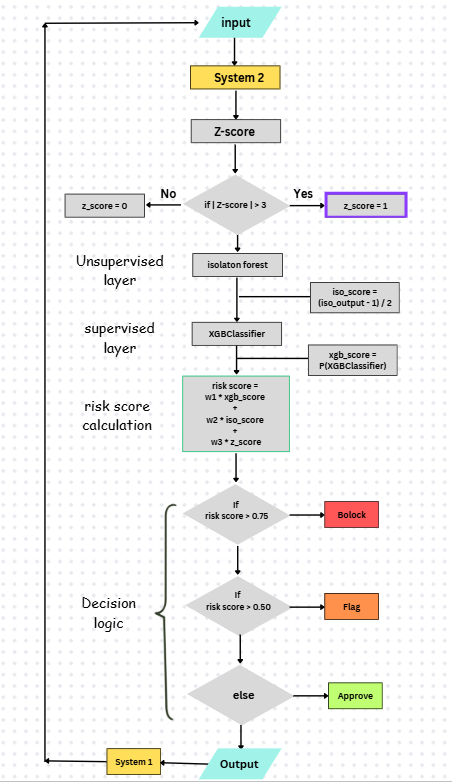
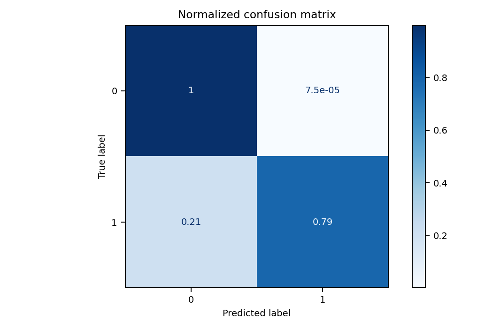
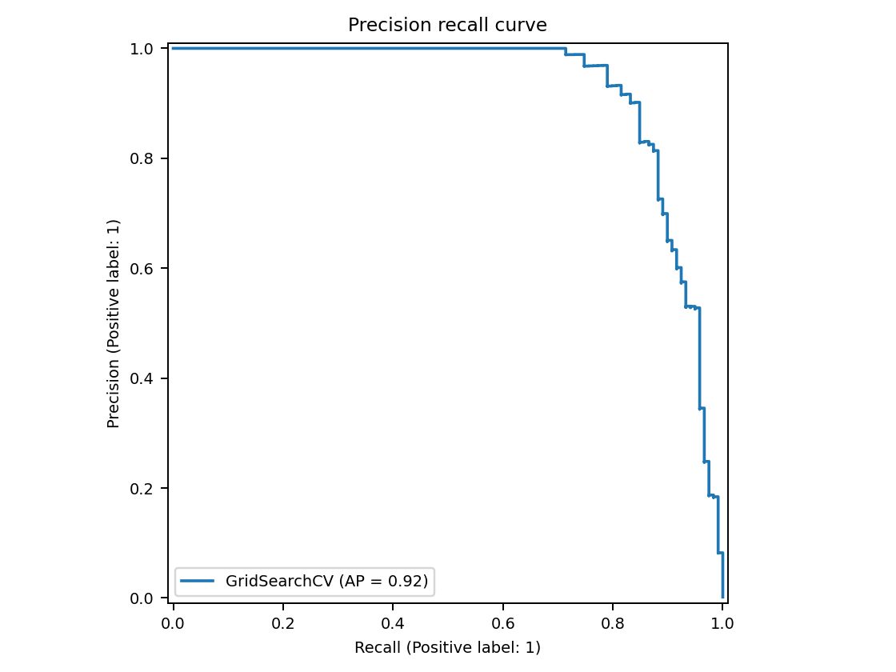
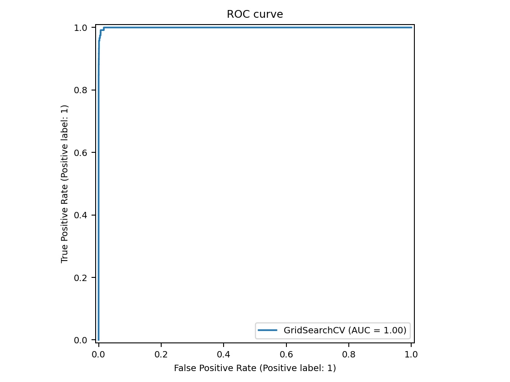

# **Transaction Fraud Detection System**

[](https://www.python.org/)
[](https://github.com/Yashuu05/FraudDetectionSystem/actions)
[](CONTRIBUTORS.md)

## About

- This is a Fraud detection system which uses machine learning algorithms and concepts to predict if the transaction is fraud or not.
- The project uses following machine learning concepts:
    1. Feature Engineering
    2. PCA (Principle Component Analysis)
    3. Encoding / Preprocessing
    4. Standardization or Normalization
    5. Permutation Importance
    6. XGBoost
    7. Isolation Forest
    8. Z score
    9. Precision, Recall, F1 score, F2 score, confusion matrix, accuracy
    10. GridsearchCV or Hyperparameter tuning
- The final `risk score` is calculated as the weighted sum of each layer's score.
- The **weights** of each layer is determined on the basis of maximium `f2 score` obtained.
- The threshold value **0.5** is considered to predict fraud which can be determined by **domain expertise.**

### Goal 
To identify or detect the fraud transactions and aware users about the risk involved to avoid loss of financial properties.

### Objective
1. To mitigate the loss of money through transactions.
2. Aware users or customers about the risk involved.

---

### Dataset : 
source : https://www.kaggle.com/datasets/sriharshaeedala/financial-fraud-detection-dataset

---

### Machine learning Algorithms used: 

2. Isolation Forest (anaomaly detection)
3. XGB classifier 

---

### System Architecture Flowchart

 

### **Explanation**

- The system is divided into two individual systems:
    1. System 1 : generates dummy but relevant transaction data
    2. System 2 : Predicts and assign risk score to each transaction
- System 2 is uses **3 layer** architecture:
    1. Z score
    2. Supervised layer 
    3. Unsupervised layer
- The `system 2` uses 3 layer archicture to reduce the dependancy on a single model/layer to predict the fraud and to leverage advantages of multiple strong model's prediction. But decision to use the algorithm is upon the individual's expertise, business goal and stakeholder requirements.
- Supervised layer uses **XGB Classifier** and Unsupervised uses **Isolation Forest** algorithm respectively.
- Both the models are trained on the same dataset with _PCA_ and _feature engineering_ to avoid **curse of dimensionality** and boost performance of model.

### Risk Score Calculation

1. **Z-score**
```
z_val = (amount - mean) / stdev
z_rule_score = 1 if abs(z_val) > 3 else 0
```

2. **XGB score**

`xgb_score = float(xgb_model.predict_proba(X)[:, 1][0])`

3. **Isolation forest score**

`iso_score = float(iso_model.predict(X)[0])`

4. **Risk Score Formula**

`risk_score = (w1 * xgb_score) + (w2 * iso_score) + (w3 * z_rule_score)`

5. **Decision logic**
```
if score > 0.6:
    critical
elif score > 0.4:
    WARNING
else:
    SAFE
```

---

**Hyperparameters**

1. XGB
```
max_depth : [5,8,10,12],
learning_rate : [0.01, 0.1, 0.2],
n_estimators: [100, 300, 500],
colsample_bytree: [0.5, 0.8, 1.0],
subsample: [0.5, 0.8, 1.0]
```

3. Isolation Forest
```
model__n_estimators: [100, 200, 300],
model__contamination: [0.01, 0.05, 0.1, 0.13],
model__max_samples: ["auto", 0.5, 0.8]
```
---

**Evaluation Metrics**

1. F2 score (primary)
2. Recall
3. Precision
4. F1 score
5. ROC_AUC score
6. Accuracy
7. Classification report

---

**Constants / Parameters**

- test_size      : 0.2,
- random_state   : 42,
- threshold      : 0.5,
- primary_metric : f2_score

---

### Results 

1. **Best Weights**

- w1: 0.56
- w2: 0.18
- w3: 0.26

2. **Metrics** (overall)

- recall   : 0.6364
- precision: 0.3684
- f1_score : 0.4667
- f2_score : 0.5556

3. **Business Impact**

- total_fraud_value_at_risk: 7543462.66
- total_fraud_value_blocked: 3489568.25
- total_fraud_value_missed : 4053894.41
- percentage_value_saved   : 46.26
- customer_friction_value  : 5846440.11
- false_positive_count     : 24
- true_positive_count      : 14
- block_to_catch_ratio     : 1.71

4. XGB Confusion Matrix



5. XGB Precision-Recall curve



6. XGB roc_auc curve

 

---

### Tech stack: 

```
-------------------------------------------------
| Library/module         |     Description       |
|------------------------|-----------------------|
| Python (3.10)          | primary language      | 
| flask                  | backend server        | 
| HTML                   | system1 structure     |
| CSS                    | Styling               |
| joblib                 | Save model weights    |
| Seaborn and matplotlib | Vsiualization         |
| Pandas                 |  data cleaning        |
| Numpy                  | system1 data genrate |
| XGBoost                |  XGboost model        |
| MlFlow                 |  Model tracking       |
| Scikit-learn           | Machine learning      |
-------------------------------------------------


```
---

## 📦 Installation

### Prerequisites

- Python 3.10 or higher
- pip 
- Anaconda 
- Visual Studio Code or other IDE
- Jupyter Notebook or Google Colab Notebook or Kaggle Notebooks
- Basic knowledge of Machine Learning

### Steps

1. **Clone the repository**
   ```bash
   git clone https://github.com/Yashuu05/FraudDetectionSystem.git
   cd FraudDetectionSystem
   ```

2. **Create a virtual environment**
   ```bash
   py -3.10 -m venv myenv
   ```
   or Using Anaconda

   ```
   conda create --name myenv python=3.10
   ```
   ```
   source venv/bin/activate
   # On Windows: venv\Scripts\activate
   # Anaconda: conda activate myenv
   ```


4. **Install dependencies**
   ```bash
   pip install -r requirements.txt
   ```

5. **Download datasets**
   Source:  https://www.kaggle.com/datasets/sriharshaeedala/financial-fraud-detection-dataset

6. **Verify installation**
   ```bash
   python -c "import [PACKAGE_NAME]; print([PACKAGE_NAME].__version__)"
   ```
